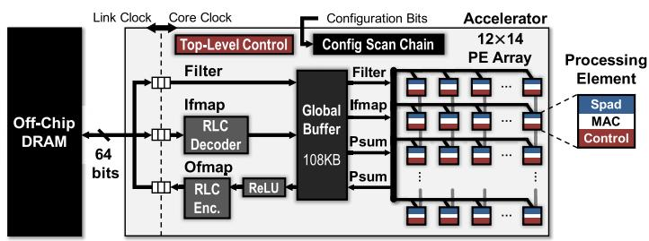
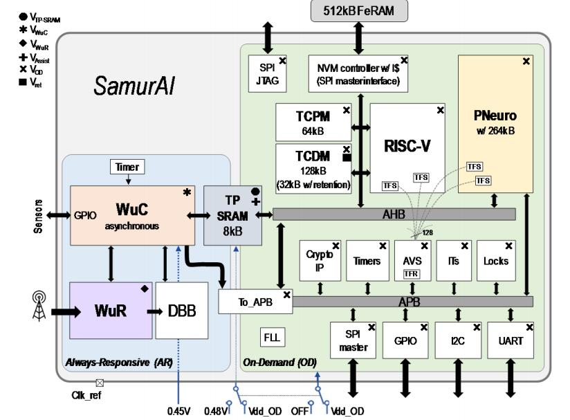
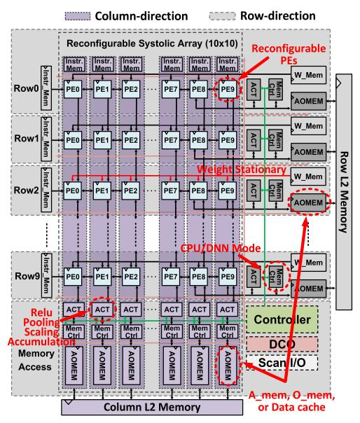
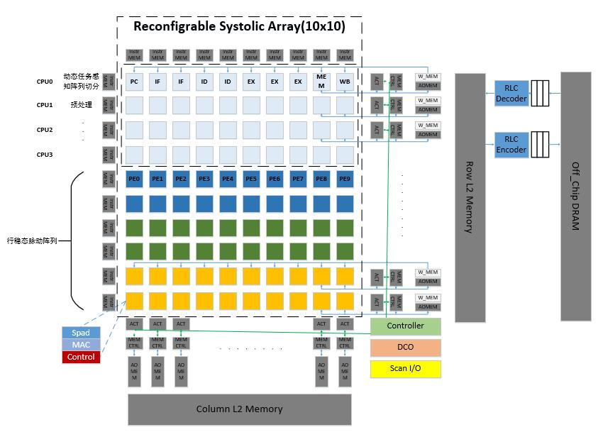

# 复旦大学研究生学位论文开题报告记录表

## 一、基本信息

### （一）学生基本信息

| 项目 | 内容 |
|------|------|
| 姓名 | 沈伟龙 |
| 学号 | 24212020160 |
| 院系 | 集成电路与微纳电子创新学院 |
| 培养层次 | 硕士 |
| 学位类型 | 专业学位 |
| 入学方式 | 硕士研究生考试 |
| 专业 | 电子信息 |
| 研究方向 | 数字集成电路设计 |
| 导师 | 来金梅 |
| 联系电话 | 17816956376 |
| 电子邮箱 | 24212020160@m.fudan.edu.cn |

### （二）开题报告基本信息

| 项目 | 内容 |
|------|------|
| 开题报告次数 | 第1次 |
| 开题时间 | 2025-12-25 |
| 开题地点 | 张江校区微电子楼269会议室 |
| 论文题目 | 面向边缘计算，支持多样化神经网络高效推理的可重构融合处理器 |
| 所属学科、专业 | 电子信息 |
| 选题来源 | 其他 |

### （三）参加学位论文开题报告的专家信息

| 姓名 | 职称 | 学科、专业 | 工作单位 |
|------|------|-----------|---------|
| 李文宏 | 教授 | 集成电路 | 复旦大学集成电路与微纳电子创新学院 |
| 来金梅 | 研究员 | 集成电路 | 复旦大学集成电路与微纳电子创新学院 |
| 肖鹏程 | 高级工程师 | 集成电路 | 复旦大学集成电路与微纳电子创新学院 |

---

## 二、导师意见

沈伟龙同学论文研究面向边缘计算，支持多样化神经网络高效推理的可重构融合处理器，主要采用算法-硬件协同设计，在 SNCPU 的可重构统一架构基础上，引入 Gemmini 风格的细粒度自定义 ISA 控制，采用权重固定（WS）数据流和双向脉动数据流，并通过动态任务感知的阵列切分算法根据模型规模动态分配资源，实现任务级流水，预期实现 VGG16、ResNet18、YOLOv5n、YOLOv7-tiny 及轻量化 ELU 等多种模型推理问题。论文将完成针对自动驾驶汽车检测行人和其他车辆对象检测，搭建 FPGA 演示系统展示成果。

---

## 三、开题报告详情

### 1. 选题有关的国内外研究综述

边缘计算（Edge Computing）是指在靠近物或数据源头的网络边缘侧，融合网络、计算、存储、应用核心能力的开放平台，就近提供边缘智能服务，以满足行业数字化在敏捷连接、实时业务、数据优化、应用智能、安全与隐私保护等方面的关键需求。面向边缘计算场景，支持神经网络模型推理处理器的主要应用场景以智能扫地机器人、工业视觉检测、智能安防监控为代表的物联网末端设备。这类设备要求处理器在极低的功耗预算下，具备处理复杂实时任务的能力。任务类型涵盖完整的"端到端"推理流程，不仅包括核心的神经网络特征提取（CNN/RNN 等），还包括图像缩放、归一化等预处理，以及非极大值抑制（NMS）等后处理任务。模型覆盖针对资源受限环境下的多尺度模型体系，包括以 VGG16/ResNet18 为代表的高精度复杂模型，以及针对实时性优化的 YOLOv5n、YOLOv7-tiny 及轻量化 ELU 等模型。目前针对边缘场景的处理器设计与研究主要有以下几种。其中，**SNCPU** 和 **Gemmini** 是本课题最核心的两个参考架构——前者提供了可重构统一架构和双向脉动数据流的基础，后者提供了细粒度自定义 ISA 和解耦访问/执行的设计范式。其余工作（Eyeriss、SamurAI、EdgeAI 等）则为 RSNCPU 基础功能之上的潜在优化方向提供参考。

#### 专用数据流加速器架构：Eyeriss

Eyeriss[3] 是一种针对卷积神经网络（CNN）的节能可重构加速器，拟解决海量数据处理导致芯片内外数据传输能耗远超运算本身，且硬件难以适应 CNN 多变的卷积形态的问题。其核心方法包括：

- **行稳态数据流**：通过重构计算映射，在 168 个处理单元（PE）的空间架构上最大化数据本地复用，减少高能耗的 DRAM 访问，同时考虑了固定架构与多尺度模型之间的匹配矛盾，减少了脉动阵列中空泡的存在。具体而言，数据流将计算分解为 1-D 卷积原语，使每个 PE 处理一行滤波器权重和一行输入特征图值，从而利用卷积重用和累加和（psum）积累优化能效。
- **硬件级压缩与门控**：引入运行长度编码（RLC）压缩技术，利用 CNN 数据中的零值特性节省内存带宽；同时采用数据门控逻辑，在检测到零值时跳过乘加运算，降低功耗。

实验结果显示，在 65nm 工艺下，Eyeriss 处理 AlexNet 可达 35 帧/秒，能效比传统方案提升 1.4–2.5 倍。Eyeriss 虽通过 RS 数据流减少 DRAM 访问，但其架构仍依赖片外存储和与 CPU 的通信，数据在层级间移动时存在冗余。例如，全局缓冲器与 PE 间的数据传输占能耗的 45%，显示通信开销未完全消除。同时 Eyeriss 专注于 CNN 加速，未涉及端到端任务中的预处理/后处理以及层间处理，导致整个处理系统的性能依然受限于孱弱的 CPU。

#### 基于 RoCC 的异构 DNN 加速器：Gemmini

Gemmini[7] 是由加州大学伯克利分校开发的一种全栈 DNN 硬件探索与评估平台，采用 Chisel 硬件描述语言实现，作为 Chipyard SoC 生态系统的一部分。Gemmini 是典型的"CPU + 加速器"异构架构，通过 RoCC（Rocket Custom Coprocessor）接口将脉动阵列加速器挂载到 Rocket 或 BOOM 处理器核心的 Tile 上，并通过系统总线直接连接到 L2 Cache。其核心方法包括：

- **脉动阵列与双数据流支持**：Gemmini 的核心是一个可参数化的脉动阵列（默认 16×16），采用两级层次结构——组合逻辑 Tile 和流水线化 Mesh。支持在运行时动态选择**输出固定（OS）**或**权重固定（WS）**数据流，为不同类型的矩阵运算提供灵活的计算映射。
- **显式管理的片上存储**：包含分组 SRAM 构成的 Scratchpad（存储输入数据，元素类型为 `inputType`，默认 INT8）和带加法器单元的累加器（存储部分和与最终结果，元素类型为 `accType`，默认 INT32）。两者按行寻址，每行宽度为 `DIM` 个元素（即脉动阵列宽度）。累加器还集成了缩放器和激活函数单元，支持量化推理中的类型转换。
- **解耦访问/执行架构**：Gemmini 将硬件划分为三个独立控制器——`ExecuteController`（执行矩阵乘法）、`LoadController`（从主存加载数据到 Scratchpad）和 `StoreController`（从 Scratchpad 存储数据到主存，同时支持最大池化）。三者通过 ROB（重排序缓冲区）检测跨控制器的指令冒险，实现并发执行和乱序调度。
- **细粒度 ISA 控制**：提供丰富的自定义 RISC-V 指令集，包括数据搬移指令（`mvin`/`mvout`）、配置指令（`config_ex`/`config_mvin`/`config_mvout`）、核心矩阵乘法指令（`matmul.preload` + `matmul.compute`），以及高级 CISC 循环指令（`gemmini_loop_ws`/`gemmini_loop_conv_ws`）用于自动分块和双缓冲大规模矩阵运算与卷积。
- **DMA 数据搬移**：通过两个 DMA 引擎（读 DMA 和写 DMA）在主存与私有 SRAM 之间传输数据，支持虚拟地址访问和 TLB 转换，通过 TileLink 协议与片上互连通信。

Gemmini 为 DNN 加速器研究提供了优秀的全栈评估框架，其参数化设计和丰富的 ISA 使研究者能够快速探索不同的架构配置。然而，Gemmini 本质上仍是传统的异构架构——CPU 和加速器物理隔离，所有数据必须通过 DMA 在 CPU 可见的主存和加速器私有 Scratchpad 之间显式搬运。这种架构在端到端推理任务中导致显著的数据通信冗余：当 CPU 完成预处理后，中间结果需先写回主存，再由 DMA 搬入 Scratchpad，层间数据同样需要反复搬运。此外，CPU 在进行预/后处理时加速器处于空闲状态，计算资源无法动态复用，存在异构资源协同低效的问题。

#### 异构多子系统 IoT 节点：SamurAI

SamurAI[4] 是一种自适应多功能物联网节点架构，旨在解决物联网应用在零星数据记录（极低功耗）与高强度图像处理（高算力）之间的矛盾。其方法包括：

- **双子系统设计**：包含一个基于异步逻辑的"始终响应"部分（AR）和一个"按需响应"部分（OD）。AR 子系统集成事件驱动的唤醒控制器（WuC），支持 207ns 快速唤醒和 1.7MOPS 算力；OD 子系统则结合同步 RISC-V CPU 和名为 PNeuro 的可编程 SIMD 加速器（含 64 个 PE），PNeuro 在电压 0.9V 下能效比为 380GOPS/W，通过 AHB 异步接口共享内存空间。
- **异构核心协同**：WuC 处理零星任务（如传感器数据过滤），而 OD 子系统在需要时激活以执行复杂计算（如机器学习推理）。这种设计实现了 15,000 倍的峰值到待机功耗降低，峰值算力达 36GOPS。

SamurAI 的 OD 子系统通过 AHB 接口与 AR 子系统共享内存，在复杂任务中可能引入同步延迟。同时 SamurAI 的 PNeuro 加速器虽支持 ML 任务，但其架构固定，难以适配多尺度模型动态变化。

#### 端到端边缘系统优化：EdgeAI 性能表征研究

EdgeAI 性能表征研究[2] 聚焦于边缘 AI 推理系统的端到端优化，针对对象检测（包括自动驾驶汽车检测行人和其他车辆）应用提出多种方法（支持 YOLOv2、YOLOv3 等）。

- **并行计算与流水线**：采用 OpenMP 和 Intel MKL 优化 CPU 上的预处理任务（如图像编码），并设计软件流水线重叠数据传输与 NPU 计算时间，减少预处理瓶颈。例如，在 LiDAR 点云处理中，并行化使预处理速度提升达 81%，一帧图像的处理延时由 48ms 降低到 30ms。
- **混合标定算法**：提出混合量化标定方法，通过动态范围分析最小化低精度（INT8）推理的精度损失。实验显示，均值平均精度提升 46%–64%。

研究强调，边缘系统需协同优化硬件配置（如批处理大小）和软件流水线，以平衡延迟与吞吐量。但是该研究中没有对边缘场景下多尺寸模型动态变化问题提出合适的解决方法。

#### 融合架构的可重构处理器：SNCPU

SNCPU[1] 是一种结合深度学习与通用计算的脉动神经 CPU 处理器（支持 VGG16、ResNet18、ELU 等模型），其方法包括：

- **逻辑与存储重构**：将 10×10 脉动 PE 阵列设计为可重构逻辑，使其能配置为高性能 DNN 加速器或 10 个独立的 5 级流水线 RISC-V CPU 核心，逻辑复用率达 64%–80%。
- **双向脉动数据流**：开发特殊的行向/列向双向数据流，使数据在重构前后能保留在本地 SRAM 中，消除 DMA 传输开销。支持四种工作模式（如列加速器模式、行 CPU 模式），提升数据本地性。

在 65nm 测试芯片中，SNCPU 实现端到端图像分类任务性能提升 39%–64%，PE 利用率从 30%-50% 提升到 95%，CPU 预处理延时由于多核并行的原因得到降低。该处理器虽然很好地解决了通信冗余以及计算资源低效协同的问题，但是论文中也指出针对简单的网络模型，处理器的延时减少并没有像复杂模型一样明显。

#### 综合分析：三大待解决问题

综合分析现有处理器设计的实现研究，它们仍存在待解决的三大问题：

1. **端到端任务中的数据通信冗余** [1][2][3][5]：在传统异构架构中，CPU 与加速器物理隔离，数据需通过系统总线及 DMA 频繁在 L2 Cache 与 Scratchpad 之间搬运。这种"存储墙"效应导致数据传输耗时占总延时的 30% 以上，并带来了严重的无效能耗。

2. **异构计算资源的低效协同** [1][2][4][5]：边缘设备中，CPU 性能有限，常导致预/后处理阶段成为整体流程的"短板"。当 CPU 进行复杂数据处理时，高性能加速器处于空闲状态，资源无法在任务流中动态复用，导致系统能效比下降。

3. **固定架构与多尺度模型之间的匹配矛盾** [1][3][5]：传统的固定尺寸脉动阵列虽然在处理大规模矩阵运算时效率极高，但在面对多样化的轻量级模型或层结构时，由于计算密度不足导致 PE 阵列产生大量"空泡"。

#### 参考文献

- [1] Y. Ju and J. Gu, "A Systolic Neural CPU Processor Combining Deep Learning and General-Purpose Computing With Enhanced Data Locality and End-to-End Performance," in *IEEE Journal of Solid-State Circuits*, vol. 58, no. 1, pp. 216-226, Jan. 2023, doi: 10.1109/JSSC.2022.3214170.
- [2] Y. Hui, J. Lien and X. Lu, "Characterizing and Accelerating End-to-End EdgeAI Inference Systems for Object Detection Applications," *2021 IEEE/ACM Symposium on Edge Computing (SEC)*, San Jose, CA, USA, 2021, pp. 01-12, doi: 10.1145/3453142.3491294.
- [3] Y.-H. Chen, T. Krishna, J. S. Emer and V. Sze, "Eyeriss: An Energy-Efficient Reconfigurable Accelerator for Deep Convolutional Neural Networks," in *IEEE Journal of Solid-State Circuits*, vol. 52, no. 1, pp. 127-138, Jan. 2017, doi: 10.1109/JSSC.2016.2616357.
- [4] I. Miro-Panades et al., "SamurAI: A 1.7MOPS-36GOPS Adaptive Versatile IoT Node with 15,000× Peak-to-Idle Power Reduction, 207ns Wake-Up Time and 1.3TOPS/W ML Efficiency," *2020 IEEE Symposium on VLSI Circuits*, Honolulu, HI, USA, 2020, pp. 1-2, doi: 10.1109/VLSICircuits18222.2020.9163000.
- [5] Y.-H. Chen, T.-J. Yang, J. Emer and V. Sze, "Eyeriss v2: A Flexible Accelerator for Emerging Deep Neural Networks on Mobile Devices," in *IEEE Journal on Emerging and Selected Topics in Circuits and Systems*, vol. 9, no. 2, pp. 292-308, June 2019, doi: 10.1109/JETCAS.2019.2910232.
- [6] J. Zhu, M. Kim, C.-H. Lu, W. Tang, T. Wei and Z. Zhang, "EVA: A 16mm² 1.54TFLOPS Tiled-Based Accelerator for Evolvable Edge Computing," *2025 Symposium on VLSI Technology and Circuits*, Kyoto, Japan, 2025, pp. 1-3, doi: 10.23919/VLSITechnologyandCir65189.2025.11075176.
- [7] H. Genc, S. Kim, A. Amid, A. Haj-Ali, V. Iyer, P. Prakash, J. Zhao, D. Grubb, H. Liew, H. Mao, A. Ou, C. Schmidt, S. Steffl, J. Wright, I. Stoica, J. Ragan-Kelley, K. Asanovic, B. Nikolic and Y. S. Shao, "Gemmini: Enabling Systematic Deep-Learning Architecture Evaluation via Full-Stack Integration," *Proceedings of the 58th Annual Design Automation Conference (DAC)*, 2021.

---

### 2. 选题的理论意义、实际意义、创新点

#### 选题意义

边缘计算作为云计算的重要补充，正推动物联网（IoT）设备向智能化发展。然而，边缘设备（如智能扫地机器人、工业视觉检测系统）常面临严格的功耗约束和实时性要求。传统"CPU + 专用加速器"异构架构在边缘环境中暴露三大瓶颈：数据通信冗余、资源协同低效及固定架构与多尺度模型不匹配。这些瓶颈导致端到端推理任务中，数据传输耗时占比超 30%，加速器利用率仅 30%-50%，严重制约边缘 AI 的普及。本研究旨在通过可重构融合处理器架构解决这些问题，提升边缘设备的能效和适应性。

#### 创新点

1. **架构创新**：针对边缘计算场景下端到端的神经网络推理任务，以 SNCPU 的可重构统一架构为基础，采用权重固定（WS）双向脉动数据流保持高数据局部性，同时引入 Gemmini 风格的细粒度自定义 RISC-V ISA 实现灵活的加速器控制，支持多模式切换，解决端到端任务中的数据通信冗余和异构计算资源低效协同问题，预期实现高数据局部性以减少通信冗余和加速器资源的高利用率。

2. **算法-硬件协同创新**：针对多样化神经网络高效推理，动态任务感知的阵列切分算法可根据模型规模动态分配资源，在权重固定数据流的基础上实现灵活的计算映射与任务级流水。解决了固定架构与多尺度模型之间的匹配矛盾，克服了固定架构的僵化问题，预期实现 VGG16、ResNet18、YOLOv5n、YOLOv7-tiny 及轻量化 ELU 等多种模型推理延时的降低。

---

### 3. 所要解决的主要问题及研究途径与方法

#### 针对异构计算资源的低效协同问题

总体上拟采用 SNCPU 论文中的逻辑与存储重构，将 10×10 的脉动 PE 阵列设计为可重构逻辑，使其既能作为高性能 DNN 加速器，也能配置为 10 个独立的 5 级流水线 RISC-V CPU 核心。同时参考 Gemmini 的解耦访问/执行架构和自定义 ISA 设计，为 RSNCPU 的加速器模式提供灵活的指令级控制。针对 CPU 性能有限的问题，利用可重构融合处理器架构本身的多核心特性加速预处理任务（后续可参考 EdgeAI 中提及的 OpenMP 并行优化方法）。

#### 针对端到端任务中的数据通信冗余问题

总体上拟采用 SNCPU 论文中提及的权重固定（WS）双向脉动数据流，将中间数据保留在本地（AOMEM 存储器中），消除传输开销。同时参考 Gemmini 的显式 Scratchpad/累加器存储管理和细粒度数据搬移指令（mvin/mvout），优化片上数据的加载与存储调度，最大限度实现 PE 本地数据复用。后续可考虑引入 Eyeriss 的 RLC 数据门控技术进一步节省内存带宽和功耗。

#### 针对固定架构与多尺度模型之间的匹配矛盾问题

在 SNCPU 架构的基础上支持动态任务感知的阵列切分策略（由重构出的 CPU 完成）。针对较小规模的网络（如 ELU 或 YOLOv5n 的某些层），不需要 10×10 全阵列并行计算。此时可将阵列"切分"，例如一半（50%）配置为 DNN 加速器，另一半配置为 5 核 RISC-V CPU。这样可以同时进行当前层的推理和下一层的层间处理，实现任务级流水线，从而抵消由于模型规模变小导致的加速器计算强度不足，提升总体延时性能。

当支持动态任务感知的阵列切分时，必然导致频繁的模式配置，最好的方式是使用**自定义指令**实现这一配置过程。（否则需采用内存映射 I/O，CPU 必须通过多条标准的存储指令来写入控制寄存器。这不仅会增加指令执行的数量，还会涉及总线竞争等开销。最危险的是动态阵列切分对响应速度要求极高。如果没有原子性的自定义指令，通过软件控制不同行/列的模式将面临极大的同步挑战。）

最终搭建 FPGA（ffg1927 系列开发板）演示系统展示成果。

---

### 4. 研究进度及具体时间安排

| 起讫日期 | 主要研究内容 | 预期结果 |
|---------|-------------|---------|
| 2025.12 – 2026.02 | 脉动阵列的研究 | 完成基础脉动阵列的搭建 |
| 2026.03 – 2026.04 | 脉动阵列重构 CPU 的方法 | 完成脉动阵列重构成 CPU 的微架构设计和验证 |
| 2026.05 – 2026.06 | 多核之间的同步问题 | 解决多核 CPU 之间的同步问题 |
| 2026.07 – 2026.07 | 重构后的模式切换 | 实现基础的自定义指令和相关的 CSR 以实现模式的配置和切换 |
| 2026.08 – 2026.09 | 动态任务感知的阵列切分算法 | 实现动态任务感知的阵列切分算法和计算映射的重构，算法部署 |
| 2026.10 – 2026.12 | 软件模型的部署 | 完成动机目标中提到的所有模型的部署和性能测试 |
| 2027.01 – 2027.01 | 整体电路的验证与中后端流程 | 完成 FPGA 的原型验证和 ASIC 中后端 |
| 2027.02 – 2027.03 | 论文撰写 | 完成论文及答辩材料，具备答辩条件 |

---

### 5. 协助导师具体指导的人员配备情况及现有条件

- **人员配备**：王健老师、李文宏老师
- **现有条件**：已具备实验所需要的软硬件环境

### 6. 与选题有关的研究工作积累、已有的研究工作成绩

- **研究工作积累**：系统研读边缘场景下支持神经网络模型推理处理器架构十多篇核心文献，了解神经网络基本原理，处理器设计方法和主要的推理加速瓶颈
- **已有的研究工作成绩**：无

### 7. 课题经费预算

预计 18 万
